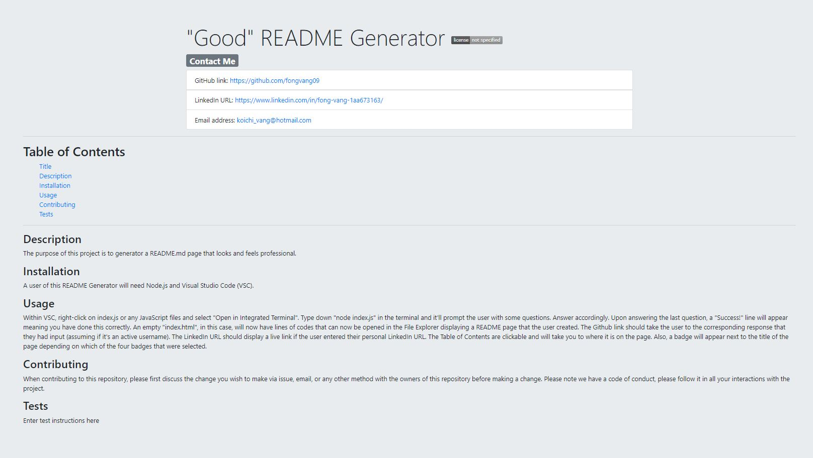
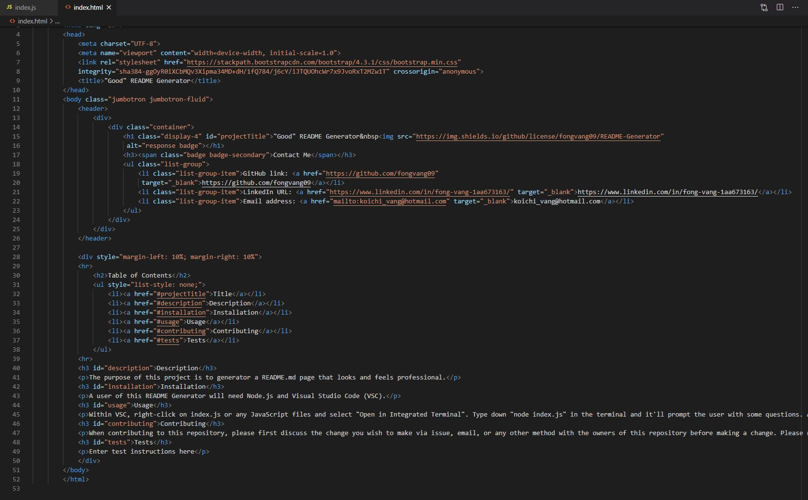

# README-Generator 

## Task of the project

To create a command-line application that dynamically generates a professional README.md file from a user's input via Node.js terminal. When completed, the generated README page should have a title with a license badge, which I had to the right side of it. Whatever that is typed in for the GitHub and LinkedIn inputs will pull it back as the link. There should also be a table of contents. If clicked on one of the links then it will bring them to the corresponding topic.

## 

## Screenshots

## Links

Deployed Link: https://fongvang09.github.io/README-Generator/

GitHub Link: https://github.com/fongvang09/README-Generator/settings

Screencastify Link: https://drive.google.com/file/d/1xyj46aX5nm0H5WXheO3gDqd_xK7sgSTD/view
